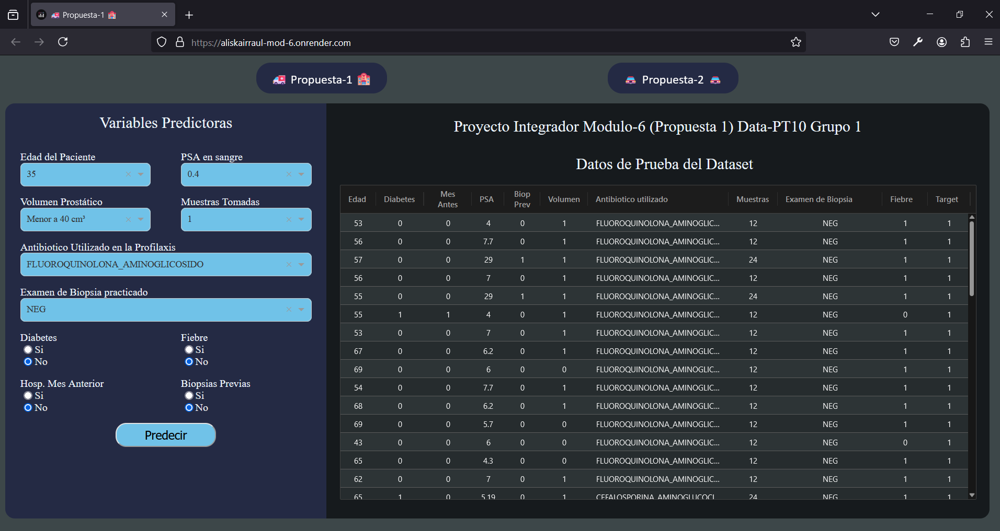
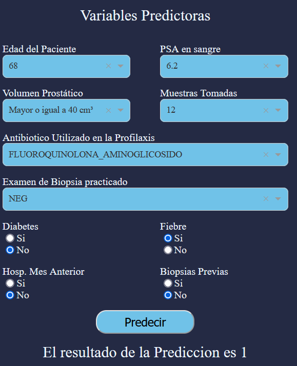
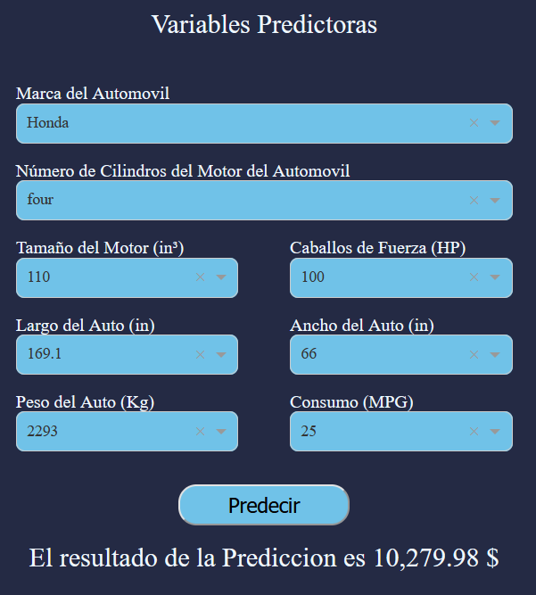

Proyecto Integrador Modulo 6

 
 
<a href="https://aliskairraul-mod-6.onrender.com/">https://aliskairraul-mod-6.onrender.com/</a>
 
 

Nota: El proyecto fue desplegado en la plataforma render.com de manera gratuita, por lo que tiene ciertas limitaciones.  La mas importante es que como no es una pagina de uso habitual permanece en reposo, y al acceder a ella (de tener minutos sin usarse la pagina), durará 50 segundos en ser desplegada, incluso a veces se necesita un segundo intento para poder dar chance a que render muestre la pagina.

La Carpeta <strong>01_jupyter</strong> contiene los Procesamientos de Datos y posterior  Creacion de Modelos de Machine Learning, tanto para la <strong>Propuesta 1</strong> (Modelo de Clasificación), guardado en la carpeta proyecto_1; como para la <strong>Propuesta 2</strong> (Modelo de Regresión), guardado en la carpeta proyecto_2 

En ambos casos encontrará los archivos <strong>01_procesando_datos.ipynb</strong> y <strong>02_modelamiento.ipynb</strong>, cuyos nombres son bastante descriptivos de lo que hacen cada uno. Y dentro de dichos archivos se va explicando, según la propuesta abarcada, los pasos a seguir y resultados obtenidos 

En cuanto a la Pagina web está se realizó en <strong>Dash</strong>, de Python. Todas las carpetas exceptuando <strong>01_jupyter</strong> contentienen lo que cada nombre de carpeta refleja.  La Hoja de estilos css se encuentra en la carpeta assets dado que es exigencia de este Framework.  

Podrá navegar entre los dos proyectos utilizando los Links de la siguiente imagen:

 
 
 

Las cajones tipo dropDown y/o radioItems, que se encuentran en la parte izquierda de la pantalla, son la manera de Ingresar los datos de las variables predictoras a los cuales les desea hacer una predicion.  Sí lo desea puede utilizar algunos Datos de prueba que se encuentran en la Tabla de la parte derecha de la pantalla, con solo hacer click en un registro específico 

 

El resultado de la Predicion aparecerá justo debajo del Boton Predecir, como se muestra en las siguientes imagenes con ejemplo para la prediccion Logística (valores 0 ó 1) o la Prediccion de Regresión

 
 
 
 
 
 

<strong>Realizado por Aliskair Rodríguez Data PT-10 Grupo 1</strong>

